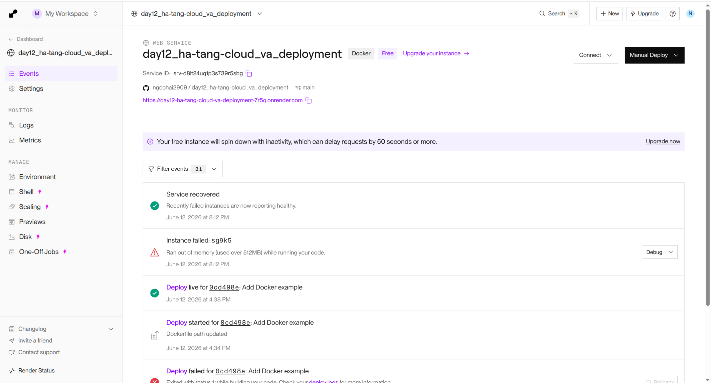
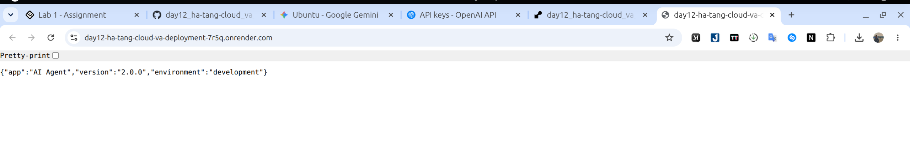

# Delivery Checklist — Day 12 Lab Submission (Filled)

> **Student Name:** Nguyễn Ngọc Hải  
> **Student ID:** 2A202600614  
> **Date Checked:** 12/06/2026

---

## 1) Repository Information

- GitHub repo: `git@github.com:ngochai2909/day12_ha-tang-cloud_va_deployment.git`
- Main lab folder verified: `06-lab-complete`

---

## 2) Runtime Verification (Executed)

Commands were run against local stack via Docker Compose in `06-lab-complete`.

### Stack status

- `docker compose up -d --build --scale agent=3`: **PASS**
- Services running: `agent x3`, `redis`, `nginx`: **PASS**

### API checks (through `http://localhost:8080`)

- `GET /health`: **PASS** (`200 OK`)
- `GET /ready`: **PASS** (`200 OK`)
- `POST /ask` without API key: **PASS** (`401 Unauthorized`)
- `POST /ask` with API key (`X-API-Key: dev-key`): **PASS** (`200 OK`, transaction created)
- Rate limit test (12 requests): **PASS** (`429` from request 11, message `Rate limit exceeded: 10 req/min`)
- `GET /metrics` without API key: **PASS** (`401`)
- `GET /metrics` with API key: **PASS** (`200 OK`, includes monthly budget/cost fields)

### Production readiness script

- `python3 06-lab-complete/check_production_ready.py`: **PASS**
- Result: **23/23 checks passed (100%)**

### Docker image size

- Built image: `06-lab-complete-agent:latest`
- Size: **233MB** (**PASS**, < 500MB)

---

## 3) Source Code Requirements Check

- [x] All code runs without errors (local runtime + checker script passed)
- [x] Multi-stage Dockerfile
- [x] Image size < 500MB
- [x] API key authentication implemented
- [x] Rate limiting 10 req/min implemented
- [x] Cost guard budget fields and checks implemented (`$10/month`)
- [x] Health + readiness checks
- [x] Graceful shutdown handling
- [x] Redis-based stateless design
- [x] No hardcoded secrets found in `main.py` / `config.py` (automated check)

---

## 4) Submission Artifacts Status

- [ ] `MISSION_ANSWERS.md` completed with all exercises (**PENDING CREATE IN THIS SESSION**)
- [ ] `DEPLOYMENT.md` with working public URL (**NOT FOUND in repo root**)
- [x] Screenshots in `screenshots/` (`lab03.png`, `runing.png`)
- [ ] Public deployment URL verified accessible (**NO URL PROVIDED YET**)

### Screenshot Evidence

- Render dashboard screenshot: [`screenshots/lab03.png`](screenshots/lab03.png)
- Service running screenshot: [`screenshots/runing.png`](screenshots/runing.png)




---

## 5) Pre-Submission Checklist (Current State)

- [ ] Repository is public (or instructor has access) *(not verified from local environment)*
- [ ] `MISSION_ANSWERS.md` completed with all exercises
- [ ] `DEPLOYMENT.md` has working public URL
- [x] All source code in `app/` directory
- [x] `README.md` has clear setup instructions
- [x] No hardcoded secrets in code
- [x] No `.env` file committed (only `.env.example`) *(local file exists; commit state not fully validated here)*
- [ ] Public URL is accessible and working
- [x] Screenshots included in `screenshots/` folder
- [x] Repository has commit history

---

## 6) Self-Test Output Snapshot

```bash
# Health
GET /health -> 200 OK

# Auth required
POST /ask (no X-API-Key) -> 401 Unauthorized

# Auth success
POST /ask (X-API-Key: dev-key) -> 200 OK

# Rate limiting
12 rapid POST /ask requests:
req 1..10 -> 400 (business validation for missing wallet)
req 11..12 -> 429 Rate limit exceeded: 10 req/min
```

---

## 7) Submit URL

```text
https://github.com/ngochai2909/day12_ha-tang-cloud_va_deployment
```

---

## 8) Remaining Items To Finish Before Final Submission

1. Create and complete `MISSION_ANSWERS.md`.
2. Create `DEPLOYMENT.md` with real public URL and test commands.
3. Confirm repo visibility/access for instructor.

